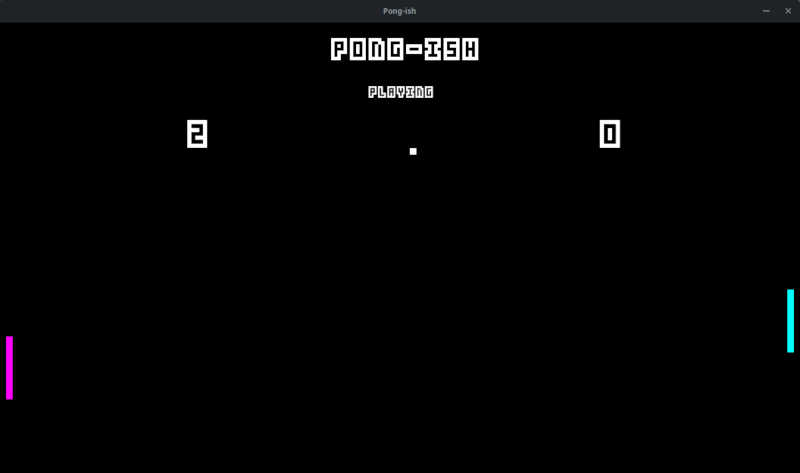
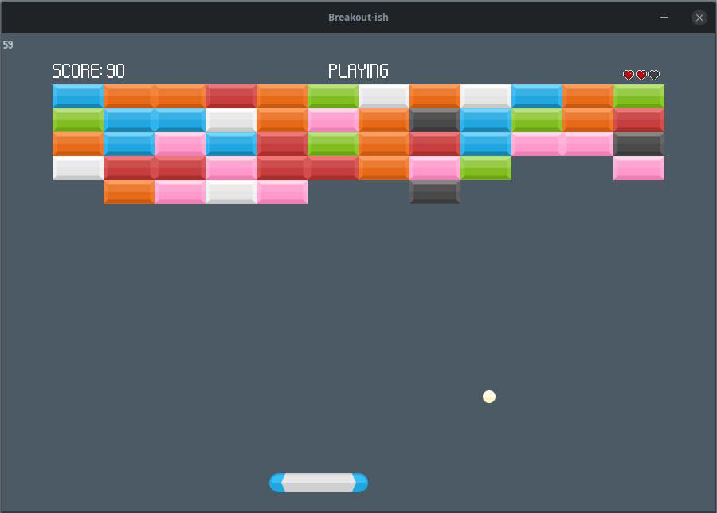

# Oyun Geliştirme Yolu - Oyunlar

> [Oyun Geliştirme Yolu](https://github.com/nuriu/oyun-gelistirme-yolu) kapsamında geliştirilen oyun projelerinden oluşan depo.

Projeler [sfml-cmake-vscode](https://github.com/nuriu/sfml-cmake-vscode) proje şablonu kullanılarak geliştirilmektedir.

Projeler;

1. [Pong-ish](https://github.com/nuriu/ogy-oyunlar/tree/master/pong-ish)

2. [Breakout-ish](https://github.com/nuriu/ogy-oyunlar/tree/master/breakout-ish)

